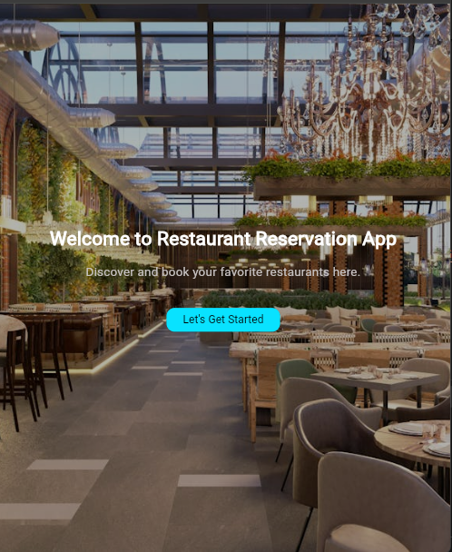
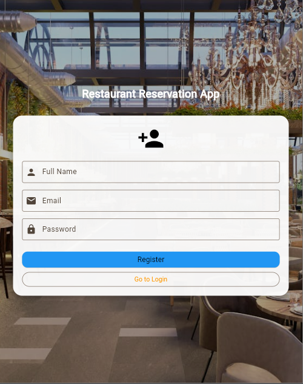
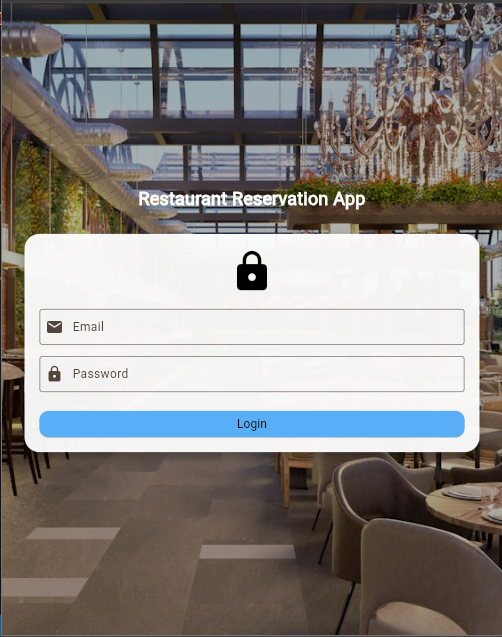
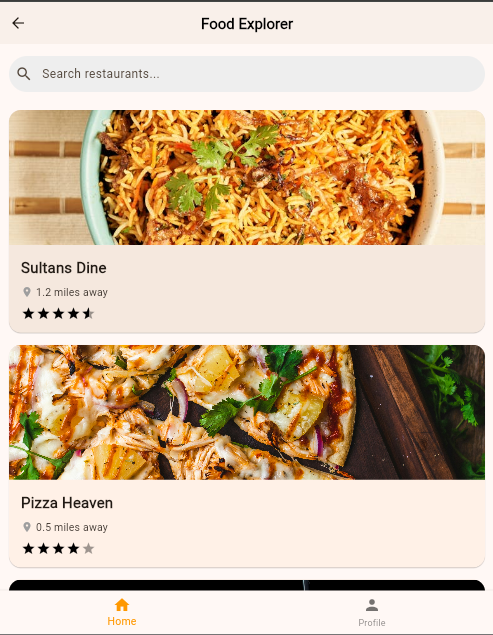
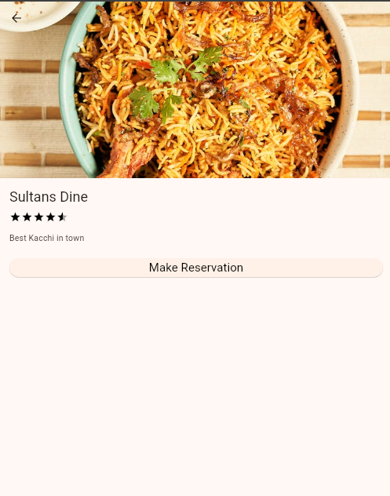
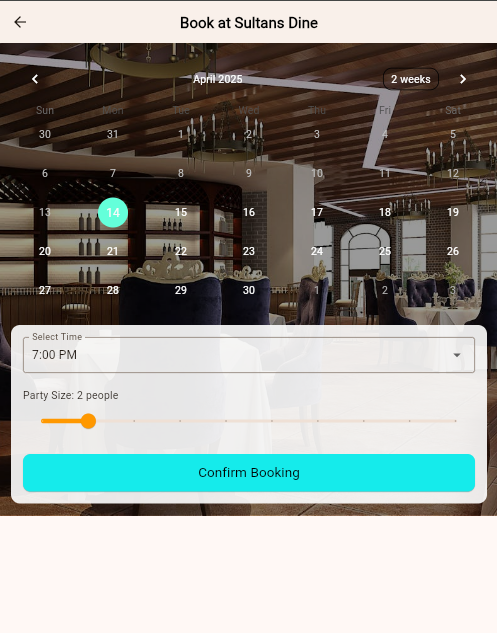

# 🍽️ Restaurant Reservation System

Welcome to the **Restaurant Reservation System** – a Flutter-based mobile application that lets users find restaurants and reserve tables effortlessly. Designed for simplicity, speed, and smart dining!

---

## 📖 Description

This app allows users to:

- 🔍 Browse restaurants
- 🪑 View table availability
- 📅 Make real-time reservations
- 👤 Manage their profiles

Restaurant Reservation System is a simple and user-friendly Flutter app that helps users discover restaurants and book tables online. It streamlines the dining experience by making reservations quick, convenient, and accessible from your phone.

---

## 📸 App Screenshots

| Welcome | Register | Log In |
|--------|----------|--------|
|  |  |  |

| Home | Details | Booking | Profile |
|------|---------|---------|---------|
|  |  |  |  |

---

## 🎥 Demo Video

▶️ [**Watch Demo Video**](https://drive.google.com/file/d/1ZhrhA_gJyDqHYfofkk0JOPQ9ElkwFe6j/view?usp=sharing)

---
## 📄 Project Report

[📘 View Report](https://drive.google.com/file/d/1UsHhMG0mVIj6WgI2bFC_Y1CijWnVB6y4/view?usp=sharing)

---

## 📦 Release APK

📲 [**Download APK**](https://drive.google.com/file/d/1fiyyUBZrPJIMsQsyDacuoOqQwVJmAOhu/view?usp=sharing)

